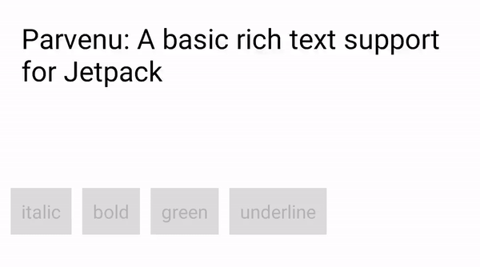

# Parvenu
A basic rich text editor support for Jetpack Compose

## What is this?
The [bug](https://issuetracker.google.com/issues/199768107) prevents us from implementing a rich text editor for Jetpack Compose. As Compose's `BasicTextField` drops spans when it is edited by a user, the library *restores* them by inspecting selection and text change.
You can try the demo app by running the `app` module.



## Installation
There is no maven repository you can use at the moment as it is currently in incubating state, so please install it by code.

## Usage
`ParvenuEditor` is a core component you can use to implement a rich text editor. It is a wrapper composable that restores styles for you. For extensibility, `ParvenuEditor` does not choose a concrete type of a text field. In other words, you may choose what type of text field you want to use.

For example, you can use the most basic type of text field: `BasicTextField`.
```kotlin
ParvenuEditor(
  value = editorValue,
  onValueChange = {
    editorValue = it
  }
 ) { value, onValueChange ->
  BasicTextField(
    modifier = Modifier
         .fillMaxWidth()
         .padding(16.dp),
    value = value,
    onValueChange = onValueChange
  )
}
```
The only thing you should do is to pass `value` and `onValueChange` to your text field composable.

If you want to use `TextField` in the compose material library, just replace `BasicTextField` with `TextField` from the example snippet above.

To initialize `ParvenuEditorValue`, use the constructor:
```kotlin
var editorValue by remember { mutableStateOf(ParvenuEditorValue()) }
```
